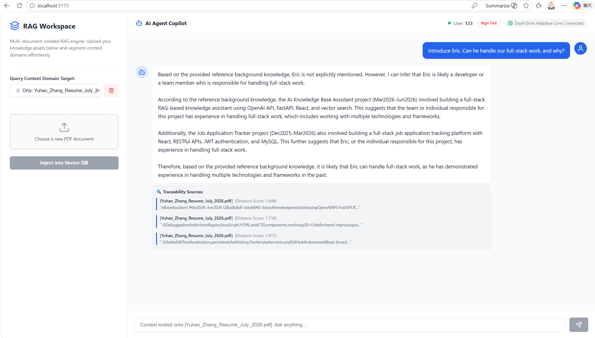

# AI Knowledge Assistant

A full-stack, RAG-powered knowledge-base assistant for uploading PDF documents and answering questions using retrieved, traceable source context.

**Live Demo:** [https://ai-knowledge-assistant-web.onrender.com](https://ai-knowledge-assistant-web.onrender.com)

## Highlights

- PDF ingestion, bilingual text chunking, and ChromaDB vector search
- Document-scoped or global retrieval with source snippets and similarity scores
- React workspace with authentication, document management, and chat history
- FastAPI backend supporting local Ollama and cloud OpenAI-compatible models

## RAG Workspace

The workspace below shows a document-scoped question-answering session and the source snippets used to ground the response.

## Tech Stack

React, Vite, Axios, FastAPI, Python, ChromaDB, PyPDF, SQLite, JWT, Ollama, OpenAI SDK, Docker Compose, and Nginx.
